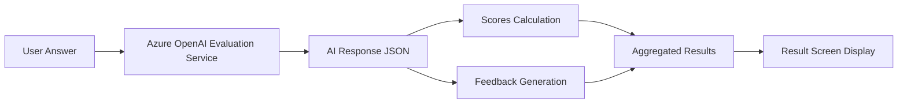

# 🎯 Assessment Mode - Hệ Thống Đánh Giá Năng Lực AI

## 📋 Tổng Quan

**Assessment Mode** là chức năng cốt lõi của hệ thống F.AI Interview, cung cấp khả năng đánh giá toàn diện năng lực người dùng thông qua phỏng vấn AI thông minh và chấm điểm tự động.

## 🏗️ Kiến Trúc Hệ Thống

### Core Components
- **`TestPanel.tsx`** - Giao diện chính của assessment
- **`evaluationService.ts`** - Service chấm điểm AI
- **`interviewService.ts`** - Service quản lý phỏng vấn
- **`ResultScreen.tsx`** - Hiển thị kết quả cuối cùng

### AI Services
- **Azure OpenAI (GPT-4)** - Engine AI chính
- **Real-time Evaluation** - Chấm điểm real-time
- **Context Management** - Quản lý context phỏng vấn

### AI Module Flow (Assessment Mode)



## 🔄 Quy Trình Hoạt Động

### Phase 1: Khởi Tạo Assessment
```
1. User chọn Field (Frontend/Backend/Full Stack)
2. User chọn Level (Junior/Mid/Senior)  
3. User chọn Duration (15/30/45 phút)
4. System tạo assessment session
5. AI khởi tạo context phỏng vấn
```

### Phase 2: Phỏng Vấn AI
```
1. AI chào hỏi và yêu cầu giới thiệu
2. User giới thiệu bản thân và kinh nghiệm
3. AI trích xuất topics từ introduction
4. AI tạo câu hỏi phù hợp với level
5. User trả lời từng câu hỏi
6. AI chấm điểm và đưa feedback real-time
```

### Phase 3: Chấm Điểm và Đánh Giá
```
1. AI đánh giá mỗi câu trả lời theo 3 tiêu chí:
   - Fundamental Knowledge (0-10)
   - Logical Reasoning (0-10)  
   - Language Fluency (0-10)

2. Hệ thống tính điểm trung bình
3. AI tạo feedback chi tiết
4. AI đưa ra gợi ý cải thiện
```

### Phase 4: Kết Quả Cuối Cùng
```
1. Tổng hợp tất cả điểm số
2. Tính điểm overall
3. Phân loại level (Beginner/Intermediate/Advanced)
4. Tạo radar chart và bar chart
5. Hiển thị kết quả chi tiết
```

## 📊 Tiêu Chí Đánh Giá

### Fundamental Knowledge (Kiến thức cơ bản)
- **Junior**: Basic concepts, syntax, tools
- **Mid**: Practical experience, best practices
- **Senior**: Advanced concepts, architecture

### Logical Reasoning (Tư duy logic)
- **Junior**: Simple problem-solving
- **Mid**: Complex problem-solving, methodology
- **Senior**: System design, strategic thinking

### Language Fluency (Khả năng giao tiếp)
- **Junior**: Basic communication
- **Mid**: Clear explanation, documentation
- **Senior**: Technical leadership, mentoring

## 🤖 AI Intelligence Features

### Smart Question Generation
- **Context-aware**: Câu hỏi phù hợp với field và level
- **Progressive difficulty**: Từ dễ đến khó
- **Avoid duplicates**: Không lặp lại câu hỏi

### Intelligent Answer Evaluation
- **Relevance check**: Kiểm tra câu trả lời có liên quan không
- **Multi-criteria scoring**: Chấm điểm theo nhiều tiêu chí
- **Real-time feedback**: Feedback ngay lập tức

### Adaptive Interview Flow
- **Dynamic topic switching**: Chuyển chủ đề thông minh
- **Progress tracking**: Theo dõi tiến độ phỏng vấn
- **Session management**: Quản lý phiên phỏng vấn

## 💾 Data Management

### Assessment Data Structure
```typescript
interface Assessment {
  id: string;
  userId: string;
  type: 'test';
  field: string;
  level: string;
  duration: number;
  history: HistoryItem[];
  realTimeScores: RealTimeScores;
  finalScores: FinalScores;
  status: 'in-progress' | 'completed';
  createdAt: Date;
  updatedAt: Date;
}
```

### History Tracking
- **Question-Answer pairs**: Lưu từng câu hỏi và câu trả lời
- **AI evaluation**: Lưu đánh giá AI cho mỗi câu
- **Real-time scores**: Cập nhật điểm số real-time
- **Progress metrics**: Theo dõi tiến độ phỏng vấn

## 🎨 User Interface Features

### Interactive Chat Interface
- **Real-time chat**: Giao diện chat với AI
- **Typing indicators**: Hiển thị AI đang suy nghĩ
- **Message history**: Lưu trữ lịch sử phỏng vấn

### Progress Visualization
- **Progress bar**: Hiển thị tiến độ phỏng vấn
- **Question counter**: Đếm số câu đã hỏi
- **Time tracking**: Theo dõi thời gian còn lại

### Results Display
- **Score cards**: Hiển thị điểm từng tiêu chí
- **Charts**: Radar chart và bar chart
- **Feedback section**: Hiển thị feedback chi tiết
- **Recommendations**: Gợi ý cải thiện

## ⚡ Technical Features

### Performance Optimization
- **Real-time updates**: Cập nhật real-time không reload
- **Efficient state management**: Quản lý state hiệu quả
- **Optimistic updates**: Cập nhật UI trước khi confirm

### Error Handling
- **Graceful degradation**: Xử lý lỗi mượt mà
- **Fallback mechanisms**: Cơ chế dự phòng khi AI fail
- **Retry logic**: Tự động thử lại khi gặp lỗi

### Security & Privacy
- **User authentication**: Xác thực người dùng
- **Data encryption**: Mã hóa dữ liệu nhạy cảm
- **Access control**: Kiểm soát quyền truy cập

## 🚀 Getting Started

### Prerequisites
- Node.js 18+
- Azure OpenAI API key
- Prisma database

### Installation
```bash
# Clone repository
git clone [repository-url]

# Install dependencies
npm install

# Setup environment variables
cp .env.example .env

# Run database migrations
npx prisma migrate dev

# Start development server
npm run dev
```

### Environment Variables
```bash
# Azure OpenAI Configuration
NEXT_PUBLIC_AZURE_OPENAI_KEY=your_azure_openai_key
NEXT_PUBLIC_AZURE_OPENAI_ENDPOINT=your_azure_endpoint
NEXT_PUBLIC_AZURE_OPENAI_DEPLOYMENT=gpt-4.0

# Database
DATABASE_URL=your_database_url

# Clerk Authentication
NEXT_PUBLIC_CLERK_PUBLISHABLE_KEY=your_clerk_key
CLERK_SECRET_KEY=your_clerk_secret
```

## 📁 File Structure

```
src/
├── app/(dashboard)/test/
│   ├── TestPanel.tsx          # Main assessment interface
│   ├── InterviewScreen.tsx    # Interview chat interface
│   ├── StartScreen.tsx        # Assessment setup screen
│   └── ResultScreen.tsx       # Results display screen
├── services/
│   ├── evaluationService.ts   # AI evaluation logic
│   ├── interviewService.ts    # Interview management
│   └── openaiService.ts       # Azure OpenAI integration
└── components/ui/test-mode/
    └── ResultsSummary.tsx     # Results visualization
```

## 🌐 API Endpoints

### Assessment Management
- `POST /api/assessment` - Tạo assessment mới
- `GET /api/assessment` - Lấy danh sách assessment
- `PATCH /api/assessment/[id]` - Cập nhật assessment
- `DELETE /api/assessment/[id]` - Xóa assessment

### Interview Processing
- `POST /api/interviews` - Bắt đầu phỏng vấn
- `PATCH /api/interviews/[id]` - Cập nhật phỏng vấn

## 📈 Performance Metrics

### Real-time Monitoring
- **Response time**: Thời gian AI phản hồi
- **Accuracy score**: Độ chính xác của AI
- **User engagement**: Mức độ tương tác của user
- **System reliability**: Độ tin cậy của hệ thống

### Optimization Strategies
- **Caching**: Cache câu hỏi và context
- **Batch processing**: Xử lý batch cho multiple requests
- **Async operations**: Xử lý bất đồng bộ cho heavy tasks

## 🐛 Troubleshooting

### Common Issues
1. **AI không phản hồi**: Kiểm tra Azure OpenAI API key
2. **Lỗi database**: Kiểm tra Prisma connection
3. **Performance chậm**: Kiểm tra API rate limits

### Debug Mode
```bash
# Enable debug logging
DEBUG=* npm run dev

# Check AI service logs
npm run logs:ai

# Monitor database queries
npm run db:monitor
```

## 🤝 Contributing

### Development Guidelines
1. Follow TypeScript best practices
2. Write comprehensive tests
3. Update documentation
4. Follow Git flow workflow

### Testing
```bash
# Run all tests
npm test

# Run specific test suite
npm test:assessment

# Run with coverage
npm test:coverage
```

## 📄 License

This project is licensed under the MIT License - see the [LICENSE](LICENSE) file for details.

## 📞 Support

- **Documentation**: [Wiki](wiki-url)
- **Issues**: [GitHub Issues](issues-url)
- **Discussions**: [GitHub Discussions](discussions-url)
- **Email**: support@fai-interview.com

---

**F.AI Interview** - Transforming Interview Experience with AI 🤖✨
