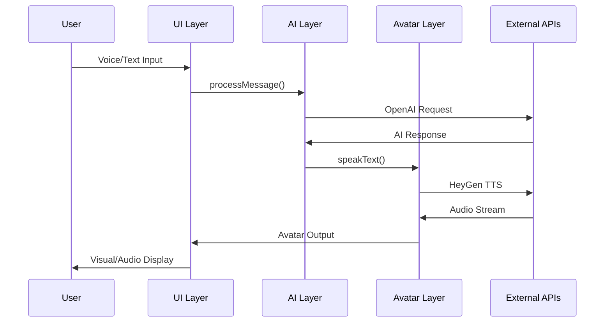

# AI Interview Data Flow Architecture

## Real-time Data Flow Diagram

```
┌─────────────────────────────────────────────────────────────────────────────────┐
│                              USER INTERFACE LAYER                               │
└─────────────────────────────────────────────────────────────────────────────────┘
                                    │
                                    ▼
┌─────────────────────────────────────────────────────────────────────────────────┐
│                            SESSION MANAGEMENT LAYER                             │
│  ┌─────────────────┐  ┌─────────────────┐  ┌─────────────────┐                  │
│  │ useAvatarInter- │  │ useConversation │  │ useInterviewApi │                  │
│  │ viewSession     │  │                 │  │                 │                  │
│  │                 │  │ • Message State │  │ • API Calls     │                  │
│  │ • Session State │  │ • Chat History  │  │ • Data Persist  │                  │
│  │ • Avatar Config │  │ • Real-time     │  │ • Error Handle  │                  │
│  │ • Job Role      │  │   Updates       │  │                 │                  │
│  └─────────────────┘  └─────────────────┘  └─────────────────┘                  │
└─────────────────────────────────────────────────────────────────────────────────┘
                                    │
                                    ▼
┌─────────────────────────────────────────────────────────────────────────────────┐
│                              AI PROCESSING LAYER                                │
│  ┌─────────────────┐  ┌─────────────────┐  ┌─────────────────┐                  │
│  │ useAIConversa-  │  │ Avatar-AI.ts    │  │ evaluation-     │                  │
│  │ tion            │  │                 │  │ Service.ts      │                  │
│  │                 │  │ • Interview     │  │                 │                  │
│  │ • Conversation  │  │   Logic         │  │ • Q&A Analysis  │                  │
│  │   Management    │  │ • Question      │  │ • Skill Scoring │                  │
│  │ • Auto-prompt   │  │   Generation    │  │ • Feedback Gen  │                  │
│  │ • Progress Track│  │ • Response      │  │ • Final Report  │                  │
│  └─────────────────┘  │   Processing    │  └─────────────────┘                  │
│                       └─────────────────┘                                      │
└─────────────────────────────────────────────────────────────────────────────────┘
                                    │
                                    ▼
┌─────────────────────────────────────────────────────────────────────────────────┐
│                              AVATAR CONTROL LAYER                               │
│  ┌─────────────────┐  ┌─────────────────┐  ┌─────────────────┐                  │
│  │ useAvatarControl│  │ VoiceInteraction│  │ VideoPlayer     │                  │
│  │                 │  │                 │  │                 │                  │
│  │ • HeyGen Avatar │  │ • Speech-to-    │  │ • Video Stream  │                  │
│  │   Management    │  │   Text          │  │ • Avatar Render │                  │
│  │ • Event Handlers│  │ • Voice Input   │  │ • Lip Sync      │                  │
│  │ • Stream Control│  │ • Audio Output  │  │ • Quality Mgmt  │                  │
│  └─────────────────┘  └─────────────────┘  └─────────────────┘                  │
└─────────────────────────────────────────────────────────────────────────────────┘
                                    │
                                    ▼
┌─────────────────────────────────────────────────────────────────────────────────┐
│                              EXTERNAL API LAYER                                 │
│  ┌─────────────────┐  ┌─────────────────┐  ┌─────────────────┐                  │
│  │ HeyGen API      │  │ OpenAI API      │  │ Question Bank   │                  │
│  │                 │  │                 │  │ API             │                  │
│  │ • Avatar Stream │  │ • GPT-4         │  │                 │                  │
│  │ • Voice Synth   │  │ • Conversation  │  │ • Context       │                  │
│  │ • Video Render  │  │ • Evaluation    │  │ • Questions     │                  │
│  │ • Token Mgmt    │  │ • Analysis      │  │ • Mapping       │                  │
│  └─────────────────┘  └─────────────────┘  └─────────────────┘                  │
└─────────────────────────────────────────────────────────────────────────────────┘
```

## Detailed Component Communication

### 1. **Message Flow Sequence**



### 2. **State Synchronization Flow**

```typescript
// State Flow Example
interface InterviewState {
  // Real-time updates
  sessionState: SessionState;
  isAvatarTalking: boolean;
  isThinking: boolean;
  
  // Conversation state
  conversationHistory: ChatMessage[];
  currentQuestion: number;
  interviewProgress: number;
  
  // Evaluation state
  skillAssessment: SkillAssessment;
  coveredTopics: string[];
  autoPromptCount: number;
}

// State Update Flow
const updateInterviewState = (newState: Partial<InterviewState>) => {
  // 1. Update local state
  setInterviewState(prev => ({ ...prev, ...newState }));
  
  // 2. Sync with UI components
  updateUIComponents(newState);
  
  // 3. Persist to database
  saveInterviewProgress(newState);
  
  // 4. Update real-time indicators
  updateProgressIndicators(newState);
};
```

### 3. **Data Transformation Pipeline**

```
Raw User Input
    ↓
[Voice Input] → Speech-to-Text → Text Input
    ↓
Text Processing
    ↓
[Language Detection] → [Content Analysis] → [Intent Recognition]
    ↓
AI Context Preparation
    ↓
[Question Bank Context] + [Conversation History] + [User Profile]
    ↓
OpenAI Processing
    ↓
[Response Generation] → [Evaluation Update] → [Progress Calculation]
    ↓
Response Processing
    ↓
[Language Localization] → [Voice Synthesis] → [Avatar Animation]
    ↓
Multi-modal Output
    ↓
[Visual Display] + [Audio Output] + [Text Display]
```

## Key Data Structures

### 1. **Interview Configuration**
```typescript
interface InterviewConfig {
  // Job Information
  field: string;           // e.g., "Frontend", "Backend"
  level: string;           // e.g., "Junior", "Mid", "Senior"
  specialization?: string; // e.g., "React", "Node.js"
  
  // Language Settings
  language: 'vi-VN' | 'en-US' | 'zh-CN' | 'ja-JP' | 'ko-KR';
  
  // Experience Requirements
  minExperience: number;
  maxExperience?: number;
  
  // Question Bank Integration
  jobRoleTitle?: string;
  jobRoleLevel?: string;
}
```

### 2. **Conversation Message**
```typescript
interface ChatMessage {
  role: 'user' | 'assistant' | 'system';
  content: string;
  timestamp: string;
  metadata?: {
    questionId?: string;
    skillTags?: string[];
    confidence?: number;
    language?: string;
  };
}
```

### 3. **Interview Response**
```typescript
interface InterviewResponse {
  answer: string;
  currentTopic: string;
  nextTopic?: string;
  shouldMoveToNewTopic: boolean;
  followUpQuestion?: string;
  interviewProgress: number;
  isInterviewComplete: boolean;
  currentScore: number;
  questionCount: number;
  completionDetails?: {
    coveredTopics: string[];
    skillAssessment: {
      technical: number;
      communication: number;
      problemSolving: number;
    };
  };
}
```

### 4. **Evaluation Result**
```typescript
interface InterviewEvaluation {
  technicalScore: number;
  communicationScore: number;
  problemSolvingScore: number;
  cultureFitScore: number;
  overallRating: number;
  technicalStrengths: string[];
  technicalWeaknesses: string[];
  recommendations: string[];
  hiringRecommendation: 'strong_hire' | 'hire' | 'consider' | 'reject';
  detailedFeedback: {
    technical: string;
    softSkills: string;
    experience: string;
    potential: string;
  };
  salary_range: {
    min: number;
    max: number;
    currency: string;
  };
  questionAnalysis?: QuestionAnalysis[];
}
```

## Performance Optimization Strategies

### 1. **Caching Strategy**
```typescript
// Question Bank Caching
const questionBankCache = new Map<string, QuestionBankContext>();

const getCachedQuestionBank = async (config: InterviewConfig) => {
  const cacheKey = `${config.field}-${config.level}-${config.language}`;
  
  if (questionBankCache.has(cacheKey)) {
    return questionBankCache.get(cacheKey);
  }
  
  const context = await fetchQuestionBankContext(config);
  questionBankCache.set(cacheKey, context);
  return context;
};
```

### 2. **Streaming Optimization**
```typescript
// Efficient Message Processing
const processMessageStream = async (messages: ChatMessage[]) => {
  // 1. Batch process messages
  const batches = chunk(messages, 10);
  
  // 2. Process in parallel
  const results = await Promise.all(
    batches.map(batch => processBatch(batch))
  );
  
  // 3. Merge results
  return results.flat();
};
```

### 3. **Memory Management**
```typescript
// Conversation History Management
const manageConversationHistory = (history: ChatMessage[]) => {
  const MAX_HISTORY = 50;
  
  if (history.length > MAX_HISTORY) {
    // Keep system messages and recent messages
    const systemMessages = history.filter(msg => msg.role === 'system');
    const recentMessages = history.slice(-30);
    return [...systemMessages, ...recentMessages];
  }
  
  return history;
};
```

## Error Recovery Mechanisms

### 1. **Connection Recovery**
```typescript
const handleConnectionError = async () => {
  // 1. Attempt reconnection
  let retryCount = 0;
  const maxRetries = 3;
  
  while (retryCount < maxRetries) {
    try {
      await reconnectAvatar();
      break;
    } catch (error) {
      retryCount++;
      await delay(1000 * retryCount); // Exponential backoff
    }
  }
  
  // 2. Fallback to text-only mode
  if (retryCount >= maxRetries) {
    enableTextOnlyMode();
  }
};
```

### 2. **AI Service Fallback**
```typescript
const processWithFallback = async (message: string) => {
  try {
    return await processInterviewResponse(message);
  } catch (error) {
    // Use cached responses or default responses
    return getFallbackResponse(message);
  }
};
```

## Monitoring & Analytics

### 1. **Performance Metrics**
```typescript
interface PerformanceMetrics {
  responseTime: number;
  avatarLatency: number;
  aiProcessingTime: number;
  userEngagement: number;
  errorRate: number;
  sessionDuration: number;
}
```

### 2. **User Experience Tracking**
```typescript
const trackUserExperience = (event: UserEvent) => {
  const metrics = {
    timestamp: Date.now(),
    eventType: event.type,
    sessionId: currentSessionId,
    userId: currentUserId,
    metadata: event.metadata
  };
  
  // Send to analytics service
  analyticsService.track(metrics);
};
```

## Security & Privacy

### 1. **Data Encryption**
```typescript
// Encrypt sensitive data
const encryptInterviewData = (data: InterviewData) => {
  return encrypt(JSON.stringify(data), ENCRYPTION_KEY);
};

// Decrypt when needed
const decryptInterviewData = (encryptedData: string) => {
  return JSON.parse(decrypt(encryptedData, ENCRYPTION_KEY));
};
```

### 2. **Access Control**
```typescript
// Verify user permissions
const verifyInterviewAccess = async (interviewId: string, userId: string) => {
  const interview = await getInterview(interviewId);
  return interview.userId === userId;
};
```


